# CTCS - Game Level For Unvanquished
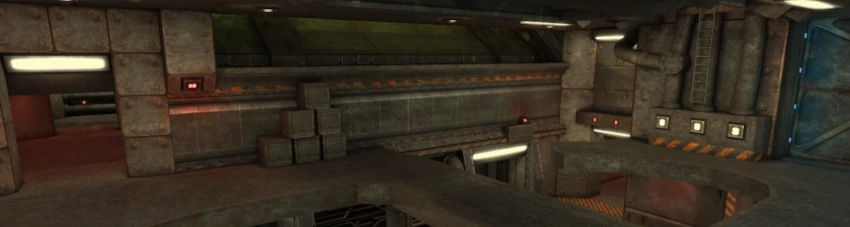 

## Overview: Sci-Fi military base in the Sahara
CTCS (Cosmic Tactical Combat Simulator) is a game level by Matthias "Masmblr" Peters for the open source game [_Unvanquished_](https://Unvanquished.net/).

##  Description: 
   CTCS is based on [_UTCSUD_](https://github.com/Masmblr/map-utcsud_src/), which was released for [_Tremulous_](https://github.com/darklegion/tremulous/).

## Screenshots:
[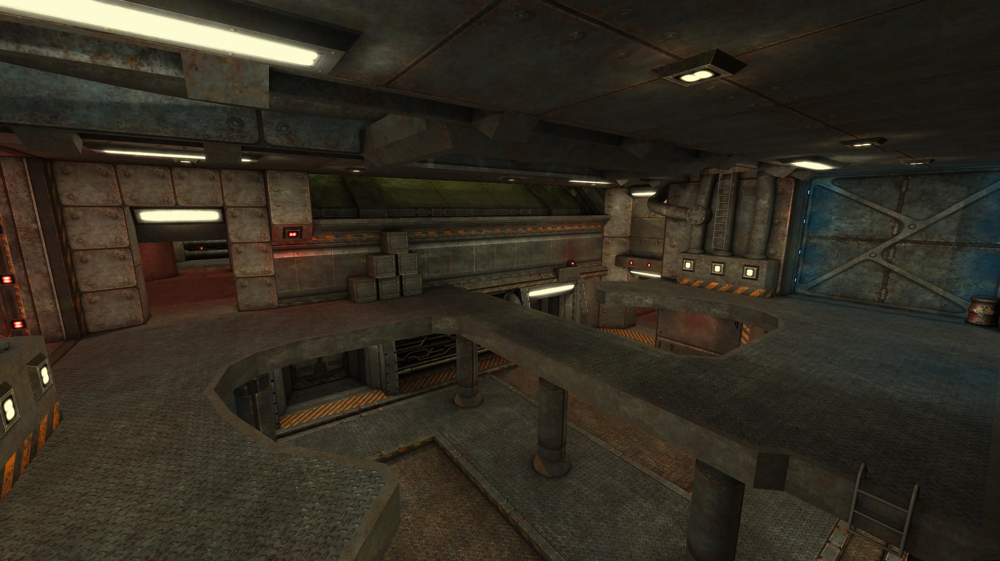](readme_meta/preview_levelshots/1.webp)
[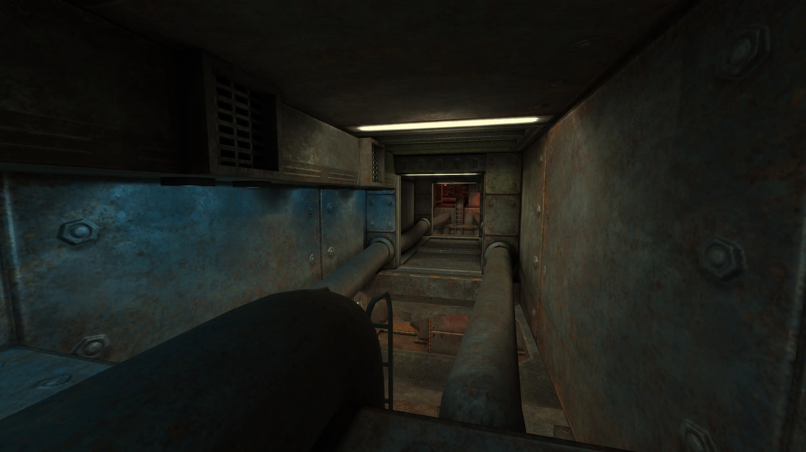](readme_meta/preview_levelshots/2.webp)
[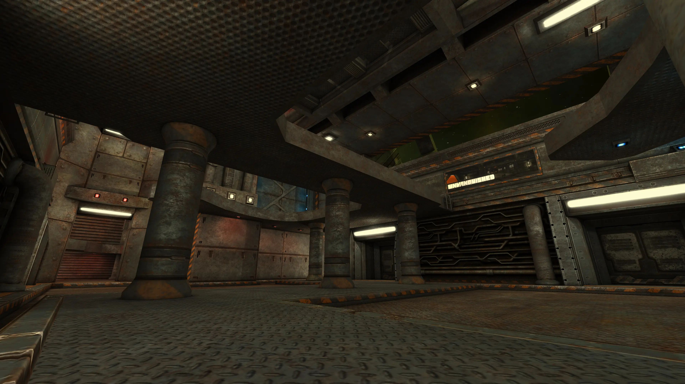](readme_meta/preview_levelshots/3.webp)
[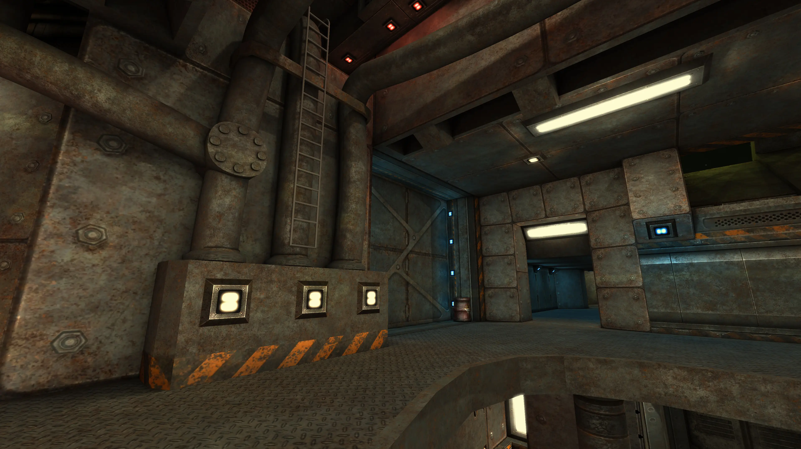](readme_meta/preview_levelshots/4.webp)
[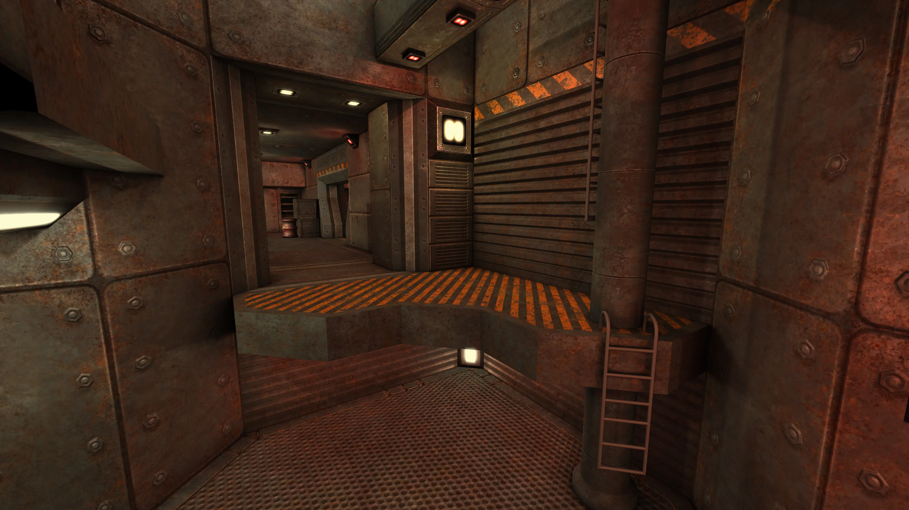](readme_meta/preview_levelshots/5.webp)
[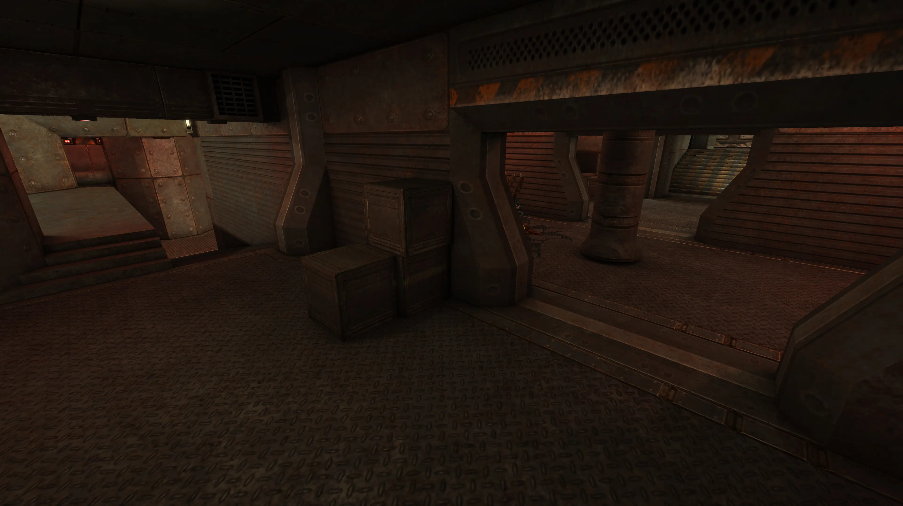](readme_meta/preview_levelshots/6.webp)
[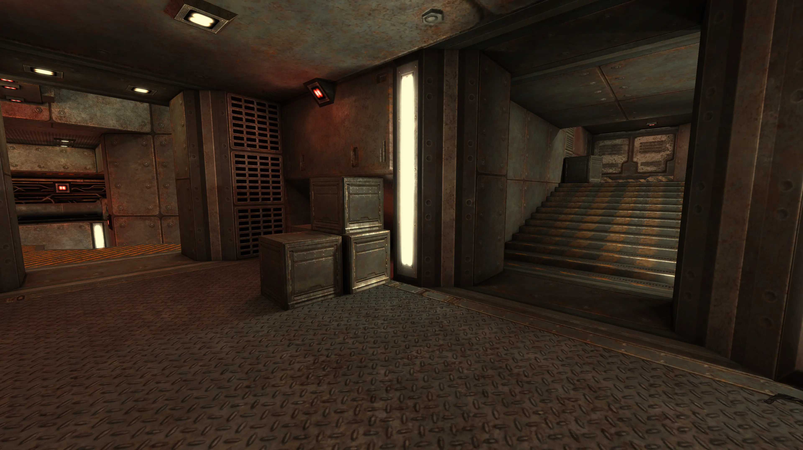](readme_meta/preview_levelshots/7.webp)
[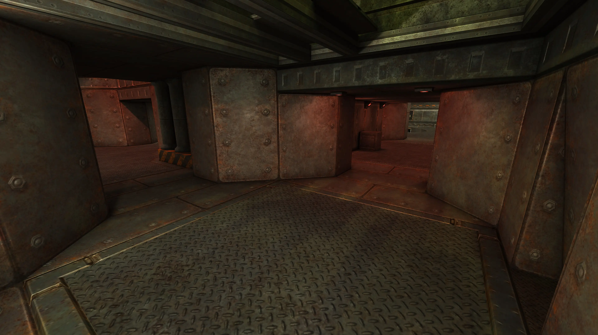](readme_meta/preview_levelshots/8.webp)
[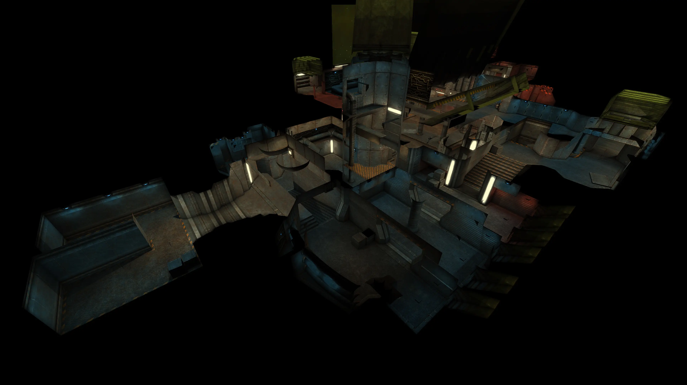](readme_meta/preview_levelshots/9.webp)
[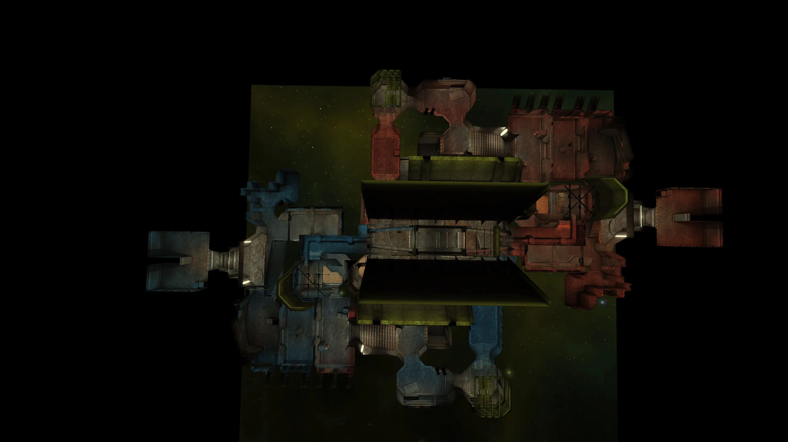](readme_meta/preview_levelshots/10.webp)

## History:
| Version: | Date:        | Status: |    
| ------- | ------------- | ------: | 
| 1.0    | 29/01/2017  | alpha |
| 1.1    | 19/01/2017  | beta |

 * * *

    Changelog:
    
    19.01.2017: v1.0
    -Initial release
    
    29.01.2017: v1.1
    -NavMeshes added (thanks to illwieckz)
    -Textures fixes
    -Image-Format changes
    -Size reduced
    -Source cleanup

 * * *

## Development Tools:
[GIMP](https://www.gimp.org/) \
[Photoshop](https://www.adobe.com/de/products/photoshop.html) \
[Audacity](https://www.audacityteam.org/) \
[NetRadiant](https://netradiant.gitlab.io/) (v1.5.0-20220628) \
[Q3Map2](http://q3map2.robotrenegade.com/) \
[Notepad++](https://notepad-plus-plus.org/) \
[Visual Studio Code](https://code.visualstudio.com/)

## Thanks to:
* id Software for Quake3
* Team Xonotic for NetRadiant 
* Unvanquished Development for Unvanquished

## Related Resources:
Unvanquished website: https://unvanquished.net \
NetRadiant Level-Editor: https://netradiant.gitlab.io \
Unvanquished-Mapping Wiki: https://wiki.unvanquished.net/wiki/Mapping \
Quake3 Shader Manual: http://toolz.nexuizninjaz.com/shader/ \
Quake3 advanced Map-Compiler: http://q3map2.robotrenegade.com \
Excellent source of various sounds: https://freesound.org

##  Dependencies:
This map uses the following texture-packs: [tex_ex](https://github.com/UnvanquishedAssets/tex-ex_src.dpkdir), [tex_space](https://github.com/UnvanquishedAssets/tex-space_src.dpkdir) \
(Copy the pack-files from textures/* to map-ctcs_src_dpkdir/textures)

## Credits - Legal Information and Attribution
Below is a list of files along with their legal statuses. For detailed license information,
please refer to the LICENSE file or the provided link. Works that incorporate elements
influenced by other pieces are indicated with an asterisk (*) at the end, followed by the original author.

The following files are published by Matthias “Masmblr” Peters (masmblr@gmail.com)
under the CC BY 4.0 - Attribution 4.0 International license:

DEPS \
LICENSE \
README.md \
VERSION \
about/ctcs.txt \
gfx/ctcs/colorgrading.webp * ([Unvanquished Development](https://www.unvanquished.net), GNU GPLv3, CC BY-SA 2.5) \
maps/ctcs.map \
meta/ctcs/ctcs.arena \
meta/ctcs/ctcs.webp \
models/ctcs/barrel/barrel_red_radio_n.webp \
models/ctcs/barrel/barrel_red_radio_s.webp \
readme_meta/header/header.webp \
readme_meta/preview_levelshots/1.webp \
readme_meta/preview_levelshots/10.webp \
readme_meta/preview_levelshots/2.webp \
readme_meta/preview_levelshots/3.webp \
readme_meta/preview_levelshots/4.webp \
readme_meta/preview_levelshots/5.webp \
readme_meta/preview_levelshots/6.webp \
readme_meta/preview_levelshots/7.webp \
readme_meta/preview_levelshots/8.webp \
readme_meta/preview_levelshots/9.webp \
scripts/ctcs_custom.shader \
scripts/shaderlist.txt \
scripts/shared_ex.shader * ([Unvanquished Development](https://www.unvanquished.net), GNU GPLv3, CC BY-SA 2.5) \
scripts/shared_space.shader * ([Unvanquished Development](https://www.unvanquished.net), GNU GPLv3, CC BY-SA 2.5) \
sounds/ctcs/fan.opus * ([newlocknew](https://freesound.org/people/newlocknew), Attribution 4.0) \
sounds/ctcs/pump.opus * ([newlocknew](https://freesound.org/people/newlocknew), Attribution 4.0) \
textures/ctcs_custom_src/credits.webp \
textures/ctcs_custom_src/credits_add.webp \
textures/ctcs_custom_src/ctcs_03.webp \
textures/ctcs_custom_src/ctcs_03b.webp \
textures/ctcs_custom_src/ctcs_03r.webp \
textures/ctcs_custom_src/ctcs_03_blend.webp \
textures/ctcs_custom_src/ctcs_03_blend_blue.webp \
textures/ctcs_custom_src/ctcs_03_blend_red.webp \
textures/ctcs_custom_src/ctcs_03_n.webp \
textures/ctcs_custom_src/ctcs_03_s.webp \
textures/ctcs_custom_src/ctcs_fan_d.webp \
textures/ctcs_custom_src/ctcs_fan_n.webp \
textures/ctcs_custom_src/ctcs_fan_s.webp

