<h1 align="center">CTCS

[](https://github.com/Masmblr/map-ctcs_src.dpkdir/releases)
[](LICENSE)

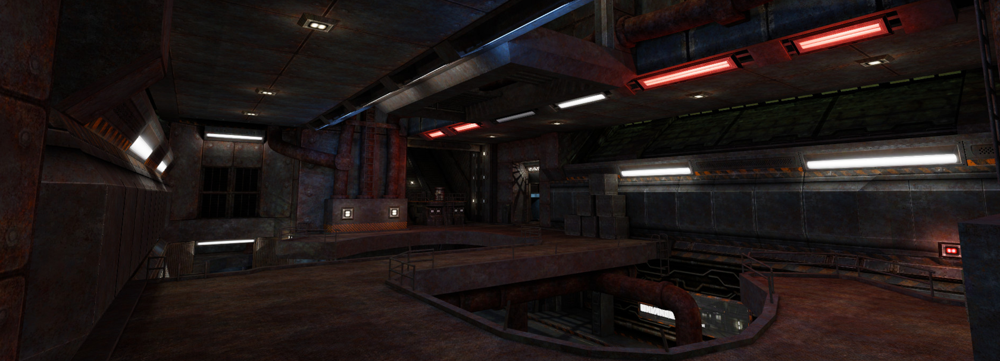

## Table of Contents
- [Introduction](#introduction)
- [Screenshots](#screenshots)
- [Install & Run](#install--run)
- [Changelog](#changelog)
- [Setup Source](#setup-source)
  - [Build](#build)
  - [Run](#run)
- [Tools](#tools)
- [Related Resources](#related-resources)
- [Acknowledgments](#acknowledgments)
- [Credits & License](#credits--license)

## Introduction
Cosmic Tactical Combat Simulator is a game level by Matthias "Masmblr" Peters for the open source game [_Unvanquished_](https://Unvanquished.net/).
This map is based on [UTCSUD](https://github.com/Masmblr/map-utcsud_src).

## Screenshots
<p align="left">
  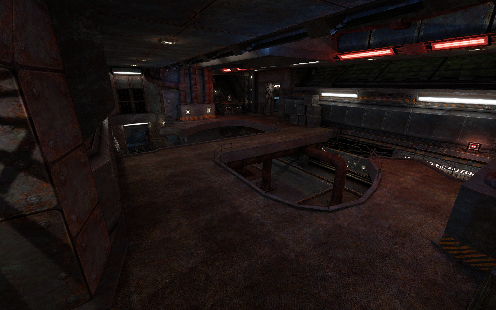
  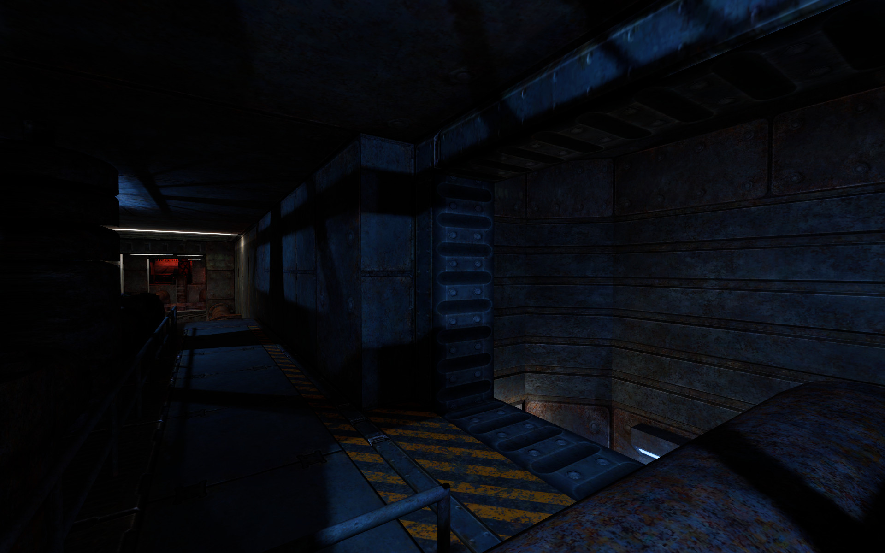
  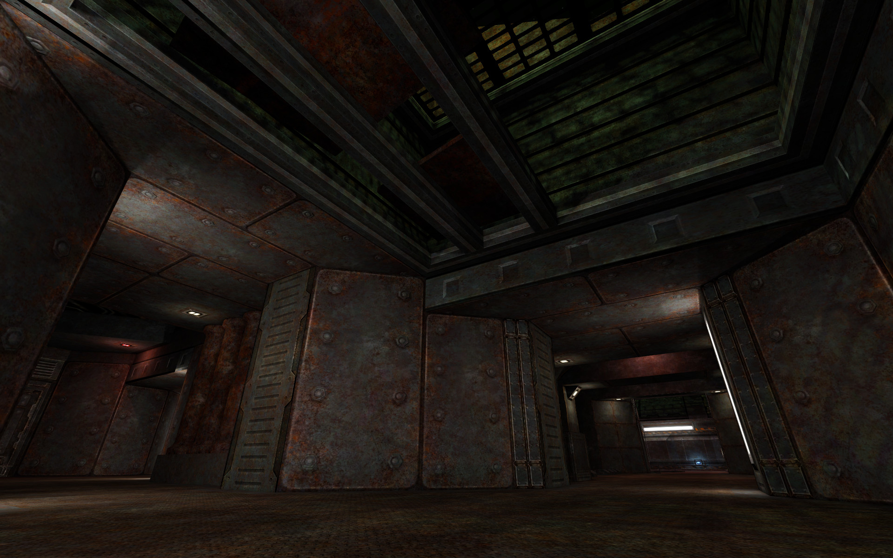
  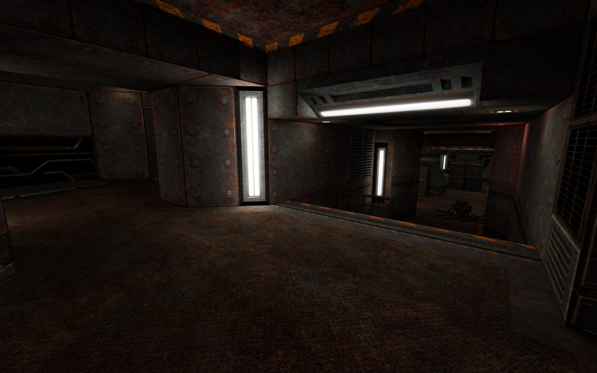
  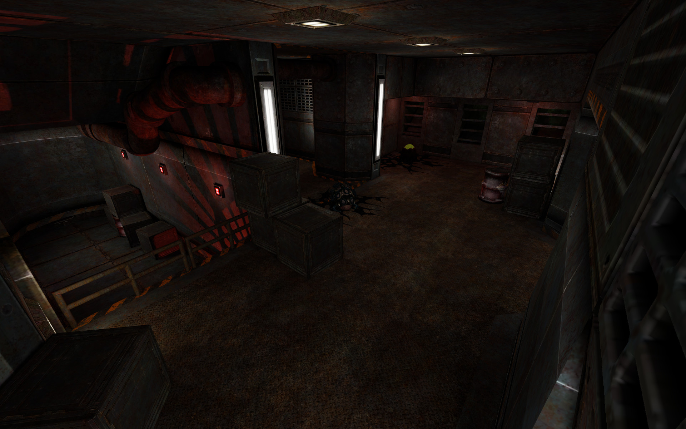
  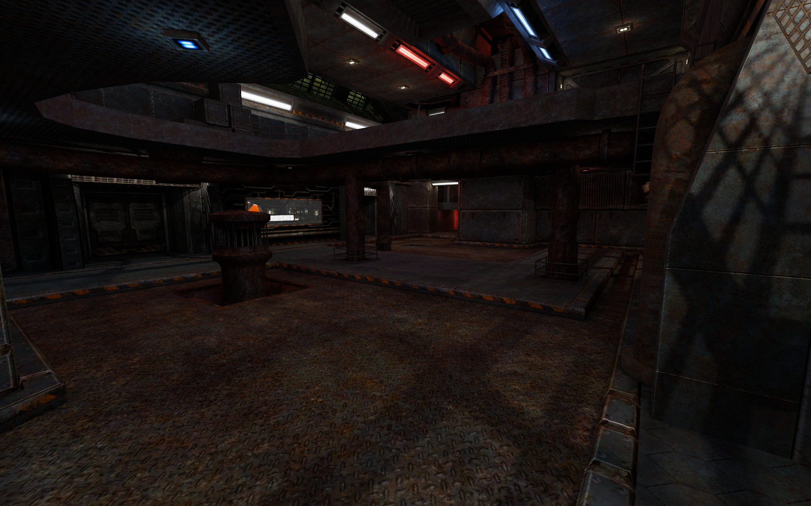
  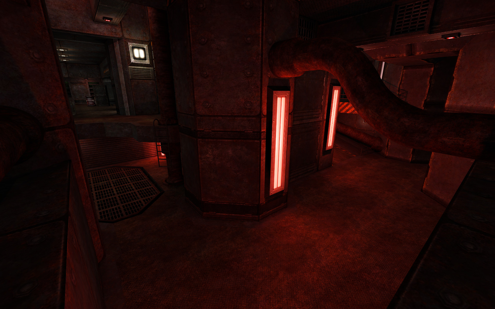
  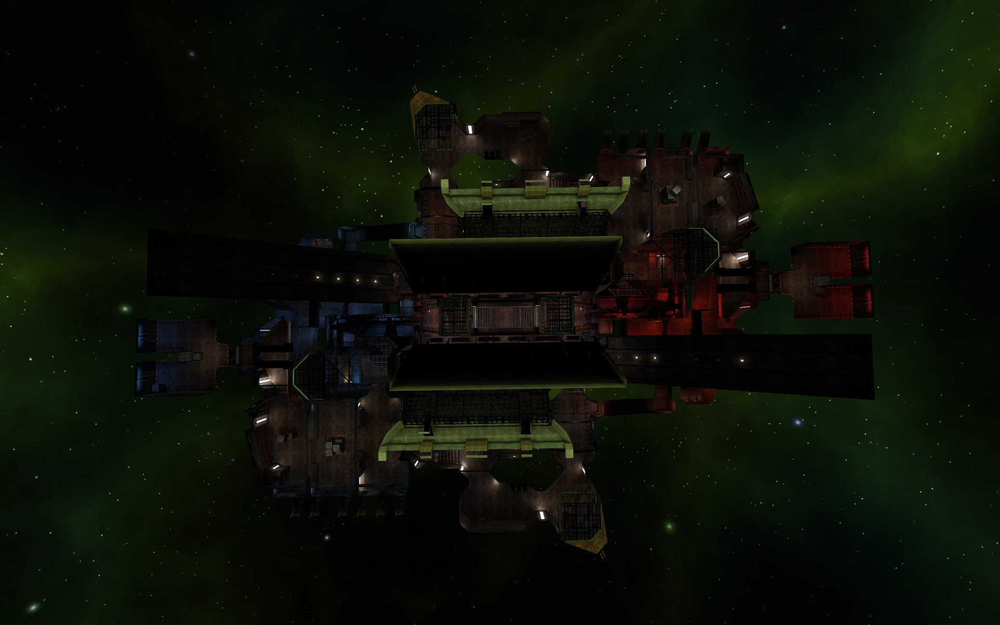
  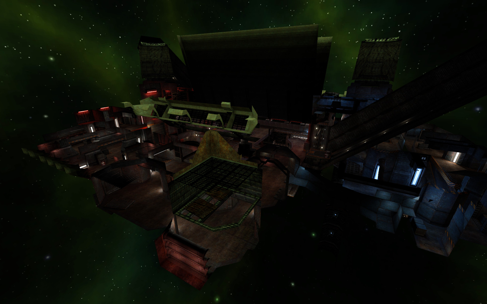
</p>

<details>
<summary>View older screenshots:</summary>

#### v1.1 Screenshots

<p align="left">
  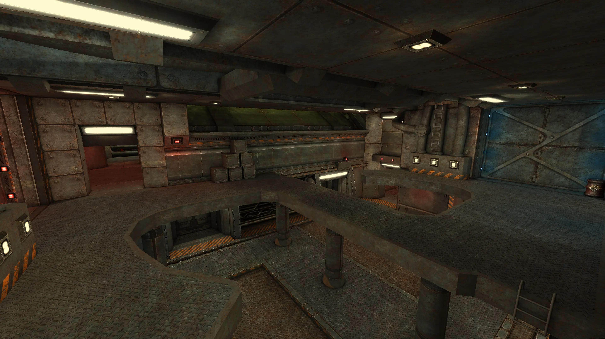
  
  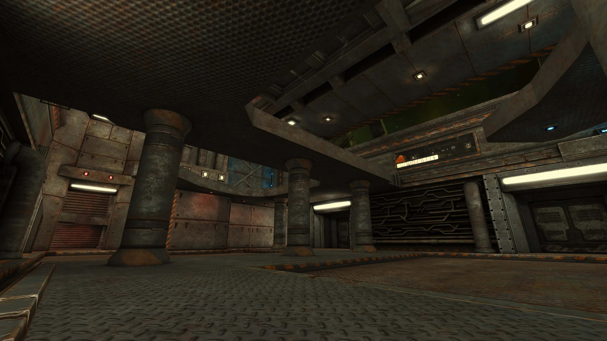
  
  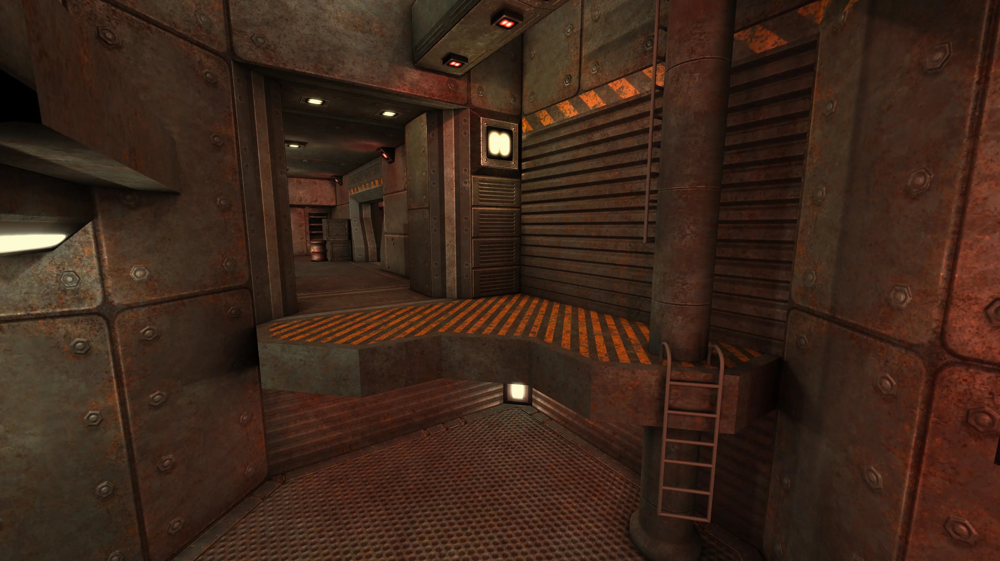
  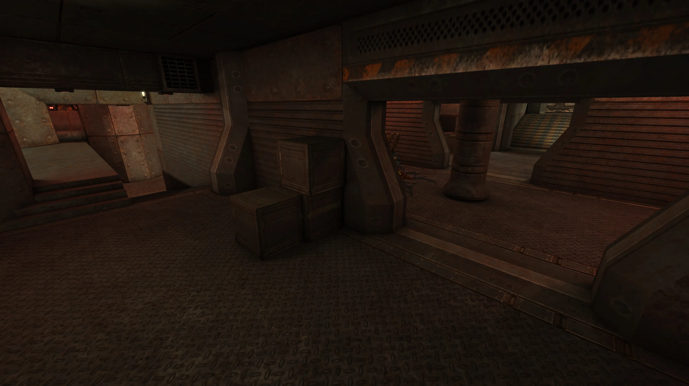
  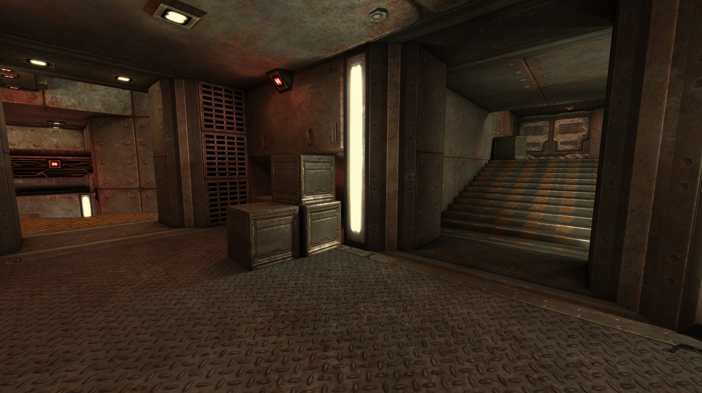
  
  
  
</p>

</details>

## Install & Run

1. Download the map and its dependencies:

| Version | Date | Status | Download (Ready to Play) |
|:---|:---|:---|:---|
| 1.0 | 2017-01-19 | Initial release | – |
| 1.1 | 2017-01-29 | beta | – |
| **1.2** | **2026-05-11** | **latest** | [*Download Map (.dpk)*](https://github.com/Masmblr/map-ctcs_src.dpkdir/releases/latest) |

2. Place the `.dpk` file(s) into your `pkg/` directory:
   - **Linux:** `~/.local/share/unvanquished/pkg/`
   - **macOS:** `~/Library/Application Support/Unvanquished/pkg/`
   - **Windows:** `%AppData%\Unvanquished\pkg\`

3. Start the game and navigate to:
   **Server Listings** -> **Start Local/LAN game** -> select **ctcs** under **Map** -> press **Start**.

## Changelog

### v1.2 (Current Version)
- Compiled with new build presets of:
  - NetRadiant Q3Map (ydnar) - v2.5.17n-git-530b81e8
  - NetRadiant - v1.5.0 Apr 23 2026 18:38:1
- Due to engine lighting changes, level-wide lighting has been redone.
- Shader and texture changes.
- Brushwork changes, mainly adding more detail:
  - Both sides now feature an added shaft tunnel and a train docking station.
  - Railings have been added to many parts of the map.
- The interiors of the stage doors have been changed:
  - The center doors have been separated and now lead independently to the other base.
- The center area now features more piping and a small pump station.
- The number of boxes has been reduced.
- Added new ambient sounds (pump, fan, computer hum).
- Texturing is now sharper: the scale of many textures was reduced or they were replaced with higher-resolution versions.
- Some lamps now feature grates to create more interesting shadow casting.
- The advertisement banner texture was reworked and fixed (corrected faulty shader programming).
- Almost all other areas have been reworked to varying degrees.
- Source refactored

<details>
<summary>View older versions</summary>

#### v1.1
- NavMeshes added (thanks to illwieckz)
- Texture fixes
- Image format changes
- Size reduced
- Source cleanup

#### v1.0
- Initial release

</details>


## Setup Source

To build or modify this map, you need to clone the source along with its dependencies (submodules).

### 1. Clone with dependencies
```
git clone --recurse-submodules https://github.com/Masmblr/map-ctcs_src.git
cd map-ctcs_src.dpkdir
```

### 2. Merge Dependencies

Run the provided script for your OS to merge the dependencies into the project structure:

Linux / macOS:
```bash
chmod +x merge.sh
./merge.sh
```

Windows (PowerShell):
```PowerShell
Set-ExecutionPolicy -Scope Process -ExecutionPolicy Bypass
.\merge.ps1
```

<details>
<summary>Dependencies:</summary>
  
[tex-common](https://github.com/UnvanquishedAssets/tex-common_src.dpkdir)  
[tex-ex](https://github.com/UnvanquishedAssets/tex-ex_src.dpkdir)  
[tex-space](https://github.com/UnvanquishedAssets/tex-space_src.dpkdir)  

</details>

> [!TIP]
> Note: You can also manually copy the contents of the dependencies/ subfolders 
> into src/map-ctcs_src.dpkdir/ or symlink them if you prefer to manage dependencies yourself.

### 3. Install & Testing

To load the map in **NetRadiant** and test it in-game, copy or link the contents of the `src/` folder into your Unvanquished pkg directory:

- **Linux:** `~/.local/share/unvanquished/pkg/`
- **macOS:** `~/Library/Application Support/Unvanquished/pkg/`
- **Windows:** `%AppData%\Unvanquished\pkg\`

It should look like this: `.../unvanquished/pkg/map-ctcs_src.dpkdir/`

### Build

If you want to compile the map yourself:

1. Install NetRadiant (v1.5.0 or higher) and choose the **Unvanquished** game profile.  
2. Open the **.map** file from `...unvanquished/pkg/map-ctcs_src.dpkdir/maps/`.    
3. Build the map by navigating to **Build** -> **Build everything for release**.

### Run
Start the map via terminal or shortcut (add `.exe` on Windows):

```bash
daemon +developer 1 +devmap ctcs
```


## Tools:
[GIMP](https://www.gimp.org/) \
[Photoshop](https://www.adobe.com/de/products/photoshop.html) \
[Audacity](https://www.audacityteam.org/) \
[NetRadiant](https://netradiant.gitlab.io/) \
[Blender](https://www.blender.org) \
[Q3Map2](http://q3map2.robotrenegade.com/) \
[Notepad++](https://notepad-plus-plus.org/) \
[Crunch](https://github.com/BinomialLLC/crunch)

## Related Resources
[Unvanquished](https://unvanquished.net)  
[NetRadiant](https://netradiant.gitlab.io )   

## Credits & License
A comprehensive list of all files and their respective licenses can be found in the following document:
[→ LICENSE](LICENSE)

## Acknowledgments
- id Software for Quake3
- Unvanquished Development for Unvanquished
- Team Xonotic for NetRadiant
